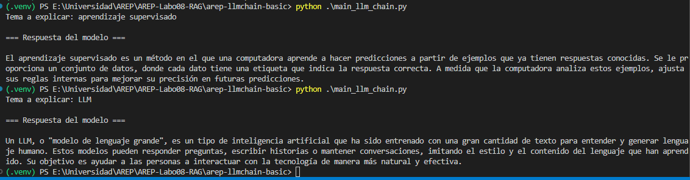
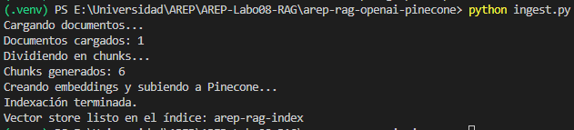
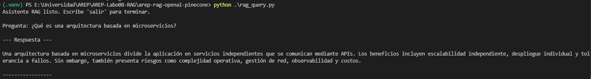

# AREP-Labo08-RAG: LangChain + RAG con OpenAI y Pinecone

Este repositorio contiene el desarrollo completo del laboratorio de Modelos de Lenguaje en la materia **Arquitecturas Empresariales (AREP)**.
Incluye dos entregables:

1. **Ejercicio 1 – LangChain LLM Chain Básico**
   Creación de un pipeline simple usando LangChain, prompts dinámicos y un modelo de OpenAI.

2. **Ejercicio 2 – RAG (Retrieval-Augmented Generation)**
   Implementación de un sistema de recuperación aumentada usando:

   - OpenAI (LLM + embeddings)
   - Pinecone (vector database)
   - LangChain (orquestación de la cadena)

Este README documenta la arquitectura, instrucciones de instalación, ejecución, y estructura del proyecto.

---

## Estructura del repositorio

```
AREP-LAB08-RAG/
│
├── .venv/                         # Entorno virtual
│
├── arep-llmchain-basic/           # Entregable 1: LLM Chain básico
│   ├── main_llm_chain.py
│   ├── .env
│   └── img/
│
├── arep-rag-openai-pinecone/      # Entregable 2: RAG con Pinecone
│   ├── data/
│   │   └── apuntes.txt
│   ├── ingest.py
│   ├── rag_query.py
│   ├── .env
│   └── img/
│
├── requirements.txt
├── .env.example
└── README.md
```

Ambos ejercicios comparten un entorno Python y dependencias comunes, definidos en `requirements.txt`.

---

# Entregable 1: LangChain LLM Chain Básico

Este ejercicio introduce el uso de **LangChain**, específicamente la construcción de un pipeline simple que combina:

- Prompt Template
- Modelo de lenguaje (`gpt-4o-mini`)
- Parser de salida
- Encadenamiento mediante LCEL (LangChain Expression Language)

## 1. Arquitectura del LLM Chain

```
Usuario → PromptTemplate → LLM (ChatOpenAI) → StrOutputParser → Respuesta
```

### Componentes principales:

| Componente           | Función                                   |
| -------------------- | ----------------------------------------- |
| `ChatPromptTemplate` | Plantilla que recibe parámetros dinámicos |
| `ChatOpenAI`         | Modelo de lenguaje de OpenAI              |
| `StrOutputParser`    | Convierte la salida del modelo en texto   |
| `                    | ` (LCEL)                                  |

---

## 2. Código principal (`arep-llmchain-basic/main_llm_chain.py`)

```python
import os
from dotenv import load_dotenv

from langchain_openai import ChatOpenAI
from langchain_core.prompts import ChatPromptTemplate
from langchain_core.output_parsers import StrOutputParser

# Cargar .env
load_dotenv()

llm = ChatOpenAI(model="gpt-4o-mini", temperature=0.5)

prompt = ChatPromptTemplate.from_template(
    "Explica en tres frases y en lenguaje sencillo el concepto de: {topic}"
)

chain = prompt | llm | StrOutputParser()

def main():
    topic = input("Tema: ")
    result = chain.invoke({"topic": topic})
    print("\n== Respuesta ==\n", result)

if __name__ == "__main__":
    main()
```

---

# Entregable 2: RAG con OpenAI + Pinecone

Este ejercicio implementa un **Retrieval-Augmented Generator**, donde la respuesta generada por el modelo se basa en:

1. Un conjunto de documentos locales (en `/data/apuntes.txt`)
2. Los embeddings de esos documentos almacenados en Pinecone
3. Un pipeline RAG que consulta el vector store y genera una respuesta basada **únicamente en el contexto recuperado**

---

## Scripts principales

### **`ingest.py`**

- Carga documentos de `/data/apuntes.txt`
- Divide en chunks
- Genera embeddings con `text-embedding-3-small`
- Los sube a Pinecone

### **`rag_query.py`**

- Crea un retriever desde Pinecone
- Construye una cadena RAG con `RunnablePassthrough`
- Permite hacer preguntas por consola

---

# Instalación del proyecto

## 1. Crear entorno virtual

```bash
python -m venv .venv
# Windows
.\.venv\Scripts\activate
# Linux/Mac
source .venv/bin/activate
```

---

## 2. Instalar dependencias

```bash
pip install -r requirements.txt
```

---

## 3. Configurar variables de entorno

Editar el archivo `.env` a partir de `.env.example`:

```env
OPENAI_API_KEY=sk-xxxx
PINECONE_API_KEY=xxxx
PINECONE_INDEX_NAME=arep-rag-index
```

En Pinecone, crear un índice:

- Nombre: `arep-rag-index`
- Dimensión: 1536
- Métrica: cosine

---

# Ejecución de los proyectos

---

## 1. Ejecutar LLMChain básico

```bash
cd arep-llmchain-basic
python main_llm_chain.py
```

### Evidencias



---

## 2. Ejecutar RAG

### 1) Indexar documentos

```bash
cd arep-rag-openai-pinecone
python ingest.py
```



### 2) Realizar consultas

```bash
python rag_query.py
```

Ejemplo:

```
Pregunta: ¿Qué es una arquitectura basada en microservicios?
```



---

# Data de ejemplo: `data/apuntes.txt`

Aquí tienes un texto realista, limpio, académico y perfecto para probar el RAG.
Pégalo directamente en `apuntes.txt`.

---

# Autor

Juan Esteban Medina Rivas\
Escuela Colombiana de Ingeniería Julio Garavito\
Curso AREP – Arquitecturas Empresariales
